# Итоговое задание по анализу временных рядов

## 1. Описание временного ряда

В проекте используется набор данных Train Occupancy Time Series с Kaggle: месячная заполняемость железнодорожных вагонов, январь 1999 - июнь 2011, 150 наблюдений. Данный временной ряд был выбран, поскольку содержит выраженную годовую сезонность, умеренный тренд и достаточное количество наблюдений для сравнения различных методов прогнозирования.

Файл данных: data/raw/train_occupancy.csv.  
Ссылка на датасет: [Kaggle - Predict Train Occupancy Time Series](https://www.kaggle.com/datasets/gajjadarahul/predict-train-occupancy-time-series).

Подготовленный формат соответствует требованиям statsforecast, mlforecast и neuralforecast:

| column | meaning |
|---|---|
| unique_id | идентификатор ряда |
| ds | временная метка (Month Start) |
| y | целевая переменная - заполняемость вагонов (%) |


## 2. Постановка задачи

Цель исследования - построить и сравнить различные модели прогнозирования месячной заполняемости вагонов на горизонте 24 месяцев.

| Параметр | Выбор |
|---|---|
| Частота | Monthly Start, MS |
| Горизонт | 24 месяца |
| Тип модели | локальная модель для одного ряда |
| Глобальные модели | не требуются; ML/DL проверяются как data-driven альтернативы |
| Режим | офлайн, пакетное переобучение |
| Метрики | MAE, RMSE, MAPE, sMAPE |
| Основная метрика выбора | RMSE |
| Валидация | Rolling-origin cross-validation (5 окон, горизонт 24 месяца) |


## 3. EDA и подготовка данных

Подготовка выполняется в src/data_preparation.py и src/eda.py.

### Базовая статистика

| Проверка | Результат |
|---|---|
| Количество наблюдений | 150 |
| Период | 1999-01-01 - 2011-06-01 |
| Пропуски в y | 0 |
| Дубликаты временных меток | 0 |
| Выбросы (\|z\| > 3.5) | 0 |
| Частота | месячная (MS) |
| Сезонность | выраженная годовая, период 12 |
| Тренд | умеренный восходящий (~32% в 1999 -> ~37% в 2011) |
| Структура сезонности | аддитивная |

### Сезонные паттерны

Январь и февраль являются наиболее загруженными месяцами (~48-51.6%), июнь-август - самые пустые (~23.5-26%). Разброс внутри каждого месяца небольшой: сезонный паттерн воспроизводится из года в год практически без изменений. Это позволяет предположить наличие аддитивной сезонной структуры.

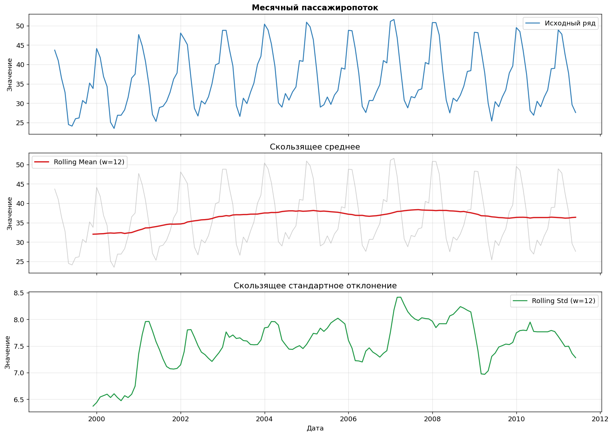

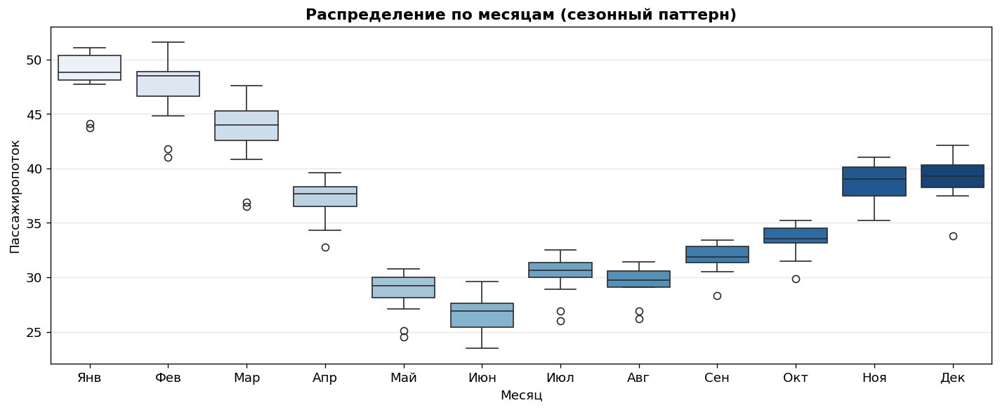

### ACF / PACF и стационарность

ACF затухает медленно с четкими пиками на лагах 12 и 24 - ряд нестационарен, сезонность годовая. На графике PACF наблюдаются значимые значения на лагах 1 и 12, что указывает на AR(1) и сезонный AR(1). На основании анализа ACF и PACF для ручной настройки была выбрана модель ARIMA(1,1,1)(1,1,1)[12].

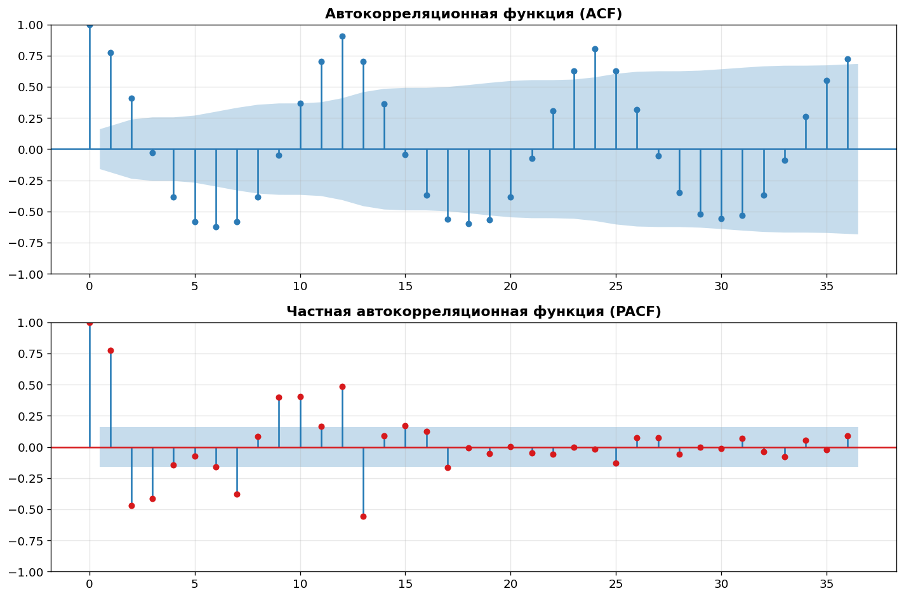

### Декомпозиция

STL-декомпозиция показала наличие аддитивной структуры временного ряда: тренд плавно растет, сезонная амплитуда (~25 п.п.) остается стабильной на протяжении всего ряда, остатки случайны и малы. Полученные результаты использовались при выборе модели ETS(A,A,A).

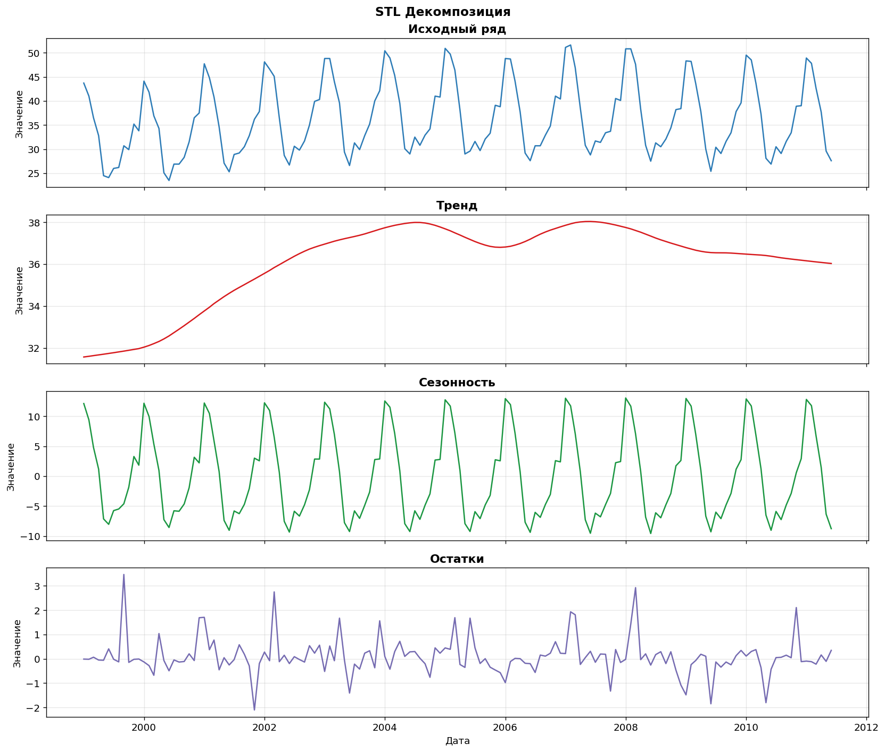

### Тесты на стационарность

Результаты тестов ADF и KPSS оказались неоднозначными, поэтому дополнительно было выполнено дифференцирование ряда.

| Тест | Статистика | p-value | Критич. 5% | Вывод |
|---|---:|---:|---:|---|
| ADF (H0: нестационарен) | −2.689 | 0.076 | −2.883 | НЕСТАЦИОНАРЕН (p > 0.05) |
| KPSS (H0: стационарен) | 0.193 | >0.100 | 0.463 | СТАЦИОНАРЕН (p > 0.05) |

Тесты дают противоречивые результаты. Полные критические значения:

ADF: 1% = −3.480, 5% = −2.883, 10% = −2.578  
KPSS: 10% = 0.347, 5% = 0.463, 2.5% = 0.574, 1% = 0.739

После первого дифференцирования (d=1) ряд стал стационарным по ADF (p=0.032).

### Выводы по задаче 1

Датасет содержит 150 месячных наблюдений за период январь 1999 - июнь 2011. Ряд характеризуется устойчивой годовой сезонностью: пики приходятся на январь-февраль (до 51.6%), минимумы - на летние месяцы (от 23.5%). Прослеживается умеренный восходящий тренд. В ходе предварительного анализа пропуски и значимые выбросы обнаружены не были. ADF и KPSS дали противоречивые результаты. После первого дифференцирования (d=1) ряд стал стационарным (ADF p=0.032)


## 4. Сравнение методов прогнозирования

Код моделей:

- src/statistical_models.py - statsforecast
- src/ml_models.py - mlforecast
- src/dl_models.py - neuralforecast
- src/pipeline.py - единый пайплайн

### 4.1 Статистические модели

Используется фреймворк statsforecast. Параметры ручных моделей были выбраны на основании результатов предварительного анализа временного ряда.

| Метод | Режим | Параметры | Обоснование |
|---|---|---|---|
| Naive | baseline | последнее значение | Базовая модель для сравнения |
| SeasonalNaive | baseline | season_length=12 | Сильный бейзлайн при годовой сезонности |
| HistoricAverage | baseline | среднее по train | Проверка пользы тренда и сезонности |
| ManualARIMA | ручной | (1,1,1)(1,1,1)[12] | Параметры из ACF/PACF: AR(1), d=1, сезонный AR(1), D=1 |
| ManualETS | ручной | ETS(A,A,A) | Аддитивная структура подтверждена STL-декомпозицией |
| AutoARIMA | авто | season_length=12 | Автоподбор порядков по информационному критерию |
| AutoETS | авто | season_length=12 | Автоподбор структуры экспоненциального сглаживания |
| AutoTheta | авто | season_length=12 | Компактная трендовая модель |

Валидация: rolling-origin cross-validation, 5 окон, горизонт 24 месяца.

Анализ остатков лучшей модели (AutoETS): остатки случайно разбросаны около нуля, гистограмма и QQ-plot близки к нормальному распределению. Тест Льюнга-Бокса: p > 0.05 - автокорреляция в остатках отсутствует. Существенных нарушений предположений модели нет.

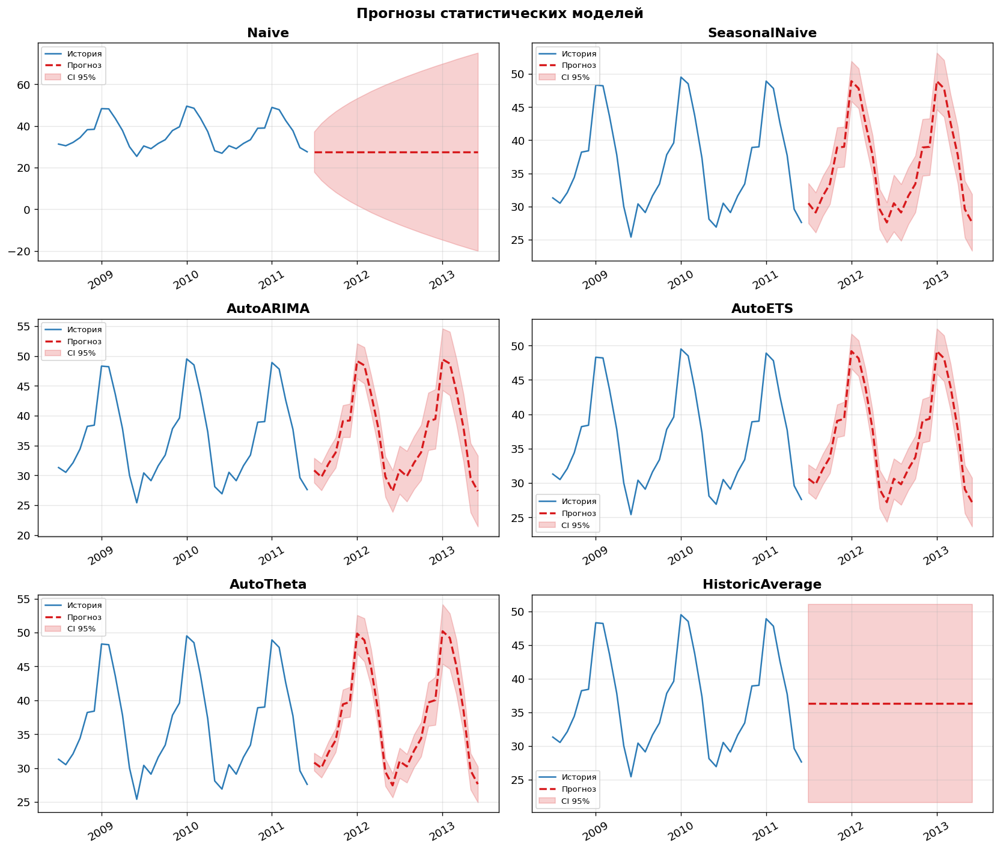

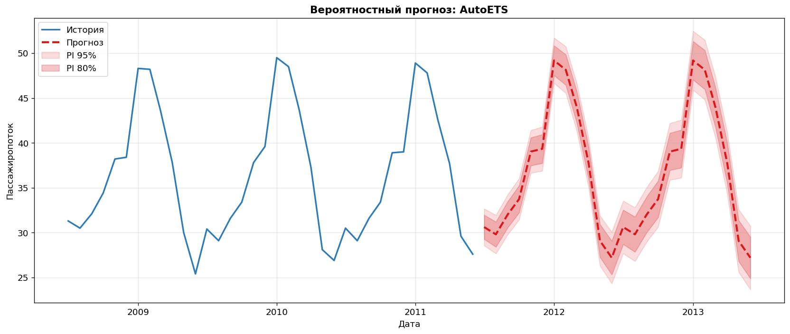

Анализ остатков AutoETS:

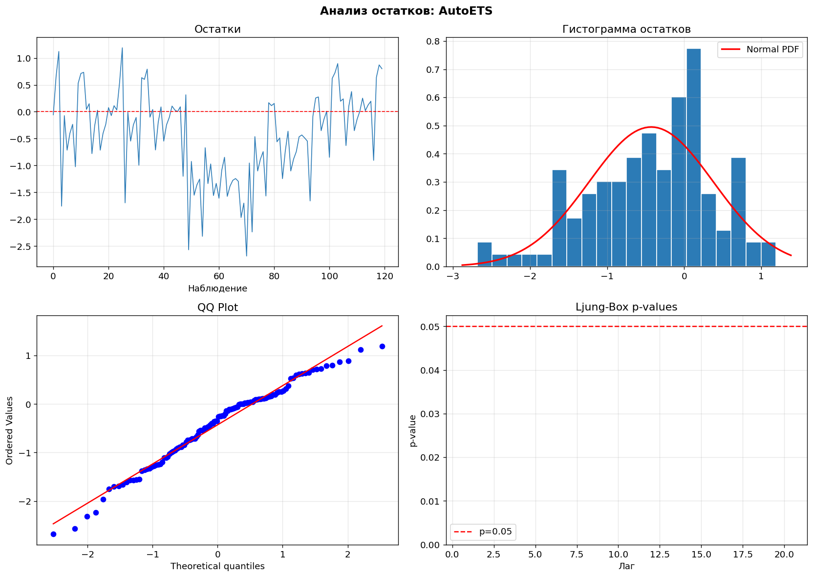

### 4.2 ML-модели

Используется фреймворк mlforecast с feature engineering:

| Признаки | Состав |
|---|---|
| Лаги | 1, 3, 6, 12 месяцев |
| Rolling mean/std | окна 3, 6, 12 месяцев |
| Календарные | месяц, квартал, год |
| Сезонные индикаторы | лето (июнь-август), зима (декабрь-февраль) |

Итого: 19 признаков.

| Метод | Обоснование |
|---|---|
| LightGBM | Выбран как один из наиболее популярных алгоритмов градиентного бустинга для табличных данных |
| XGBRegressor | Использован для оценки качества альтернативной реализации градиентного бустинга |
| RandomForestRegressor | Использован как ансамблевый метод, способный выявлять нелинейные зависимости |

Важность признаков: lag_12 (~35%) - доминирующий признак, lag_1 (~20%), rolling_mean_12 (~15%). Поведение моделей во многом определяется сезонными лаговыми признаками, особенно lag_12.

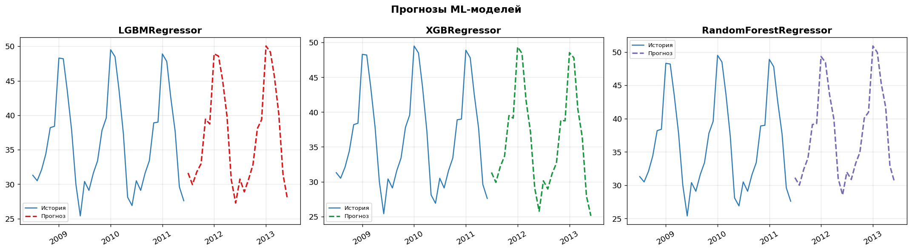

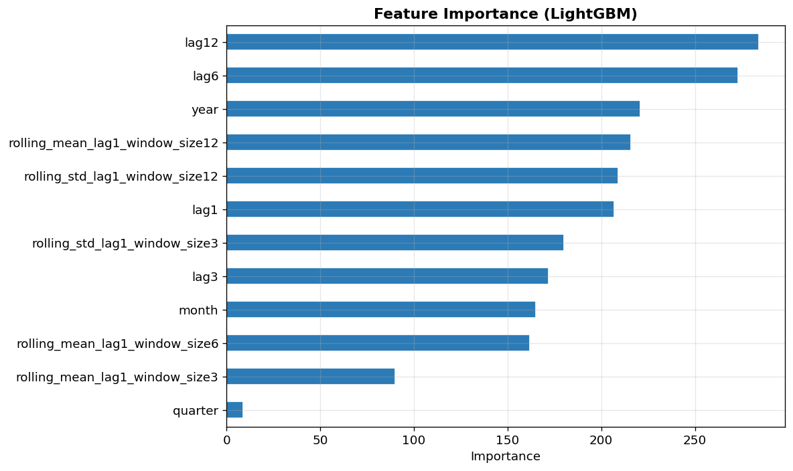

### 4.3 Deep Learning

Используется фреймворк neuralforecast, input_size=36, max_steps=500.

| Метод | Параметры | Обоснование |
|---|---|---|
| NBEATS | input_size=36, h=24 | Архитектура предназначена для моделирования тренда и сезонности временного ряда |
| NHITS | input_size=36, h=24 | Архитектура ориентирована на прогнозирование на средних и длинных горизонтах |
| LSTM | input_size=36, h=24 | Рекуррентная нейронная сеть, предназначенная для моделирования временных зависимостей |

Для бектестинга DL использовалось 3 окна (вместо 5) из-за вычислительной стоимости.

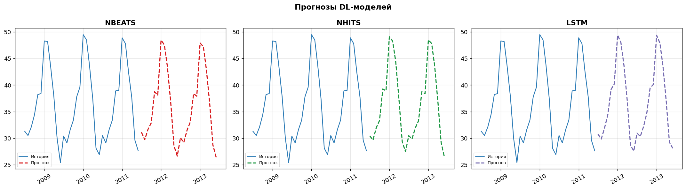


## 5. Итоговые результаты

Бектестинг (rolling-origin CV) по всем 12 моделям:

| Категория | Модель | MAE | RMSE | MAPE (%) | sMAPE (%) |
|---|---|---:|---:|---:|---:|
| Statistical | AutoETS | 0.689 | 0.910 | 2.03 | 1.99 |
| Statistical | AutoTheta | 0.779 | 0.968 | 2.24 | 2.20 |
| Baseline | SeasonalNaive | 0.927 | 1.147 | 2.79 | 2.74 |
| ML | XGBRegressor | 1.030 | 1.269 | 3.00 | 3.00 |
| ML | RandomForestRegressor | 1.050 | 1.305 | 3.07 | 3.07 |
| DL | LSTM | 1.119 | 1.367 | 3.11 | 3.04 |
| Statistical | ManualETS | 1.276 | 1.407 | 3.77 | 3.68 |
| Statistical | ManualARIMA | 1.373 | 1.630 | 3.88 | 3.98 |
| ML | LGBMRegressor | 1.329 | 1.651 | 4.02 | 3.92 |
| Statistical | AutoARIMA | 1.546 | 1.820 | 4.34 | 4.47 |
| DL | NBEATS | 1.506 | 1.918 | 4.13 | 4.01 |
| DL | NHITS | 1.995 | 2.439 | 5.54 | 5.34 |
| Baseline | HistoricAverage | 6.323 | 7.310 | 17.86 | 17.36 |
| Baseline | Naive | 9.132 | 11.164 | 26.14 | 25.00 |

Лучшая модель: AutoETS (RMSE=0.910, MAE=0.689, MAPE=2.03%, sMAPE=1.99%)

Ключевые наблюдения:
- AutoETS показала наилучшие результаты среди исследуемых моделей: ETS напрямую моделирует тренд и сезонность, которые являются главными компонентами этого ряда.
- SeasonalNaive (RMSE=1.147) обогнала AutoARIMA (1.820) и все DL-модели - дело в количестве значений (150 точек).
- Ручные модели (ManualETS, ManualARIMA) уступают авто-версиям: AutoETS нашел более оптимальную структуру, чем фиксированный ETS(A,A,A).
- ML-модели держатся в диапазоне RMSE=1.27-1.65: конкурентоспособны, но до статистики не дотягивают.
- DL-модели (особенно LSTM, RMSE=1.367) показали себя на уровне с ML, однако на 150 наблюдениях переобучаются и проигрывают классическим методам.

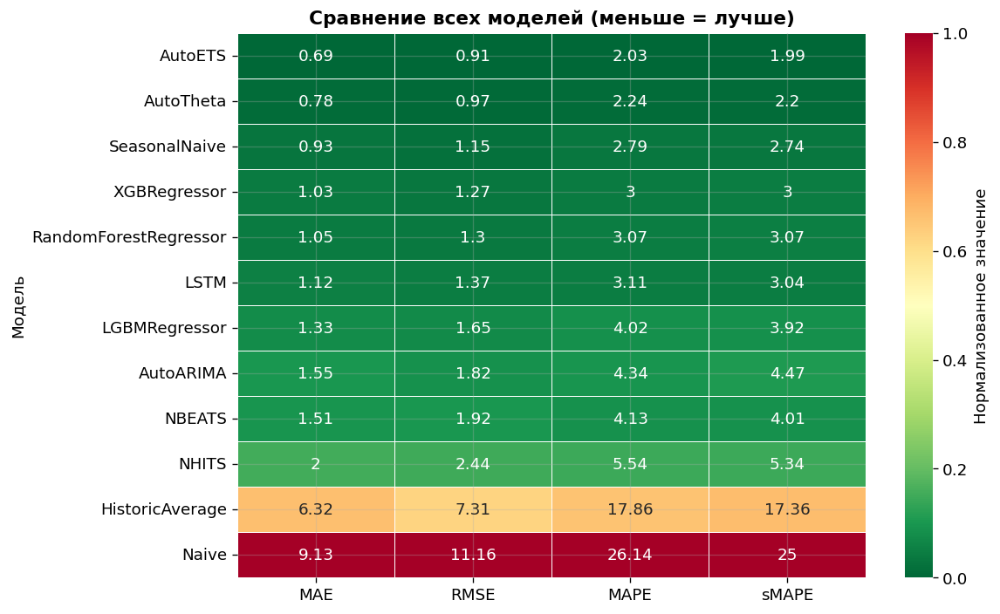

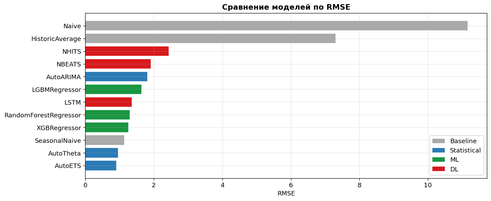


## 6. Пайплайн

### Описание

Пайплайн автоматизирует весь процесс: загрузка -> препроцессинг -> feature engineering -> обучение -> прогноз -> сохранение.

bash
pip install -r requirements.txt
python -m src.pipeline --filepath data/raw/train_occupancy.csv --mode full


### Технический состав пайплайна

| Этап                   | Время (сек) |
| ---------------------- | ----------: |
| Загрузка и подготовка  |        0.03 |
| Feature engineering    |        0.01 |
| Обучение модели        |        1.67 |
| Прогноз (24 точки)     |        0.01 |
| Сохранение результатов |        0.00 |
| Итого                  |        3.86 |


### Тестирование пайплайна

Производительность (измерено):

| Показатель | Значение |
|---|---|
| Время выполнения | 3.86 сек |
| Шагов в пайплайне | 5 |
| Признаков (feature engineering) | 19 |
| Точек в прогнозе | 24 |
| Статус | SUCCESS |

Тесты устойчивости:

| Тест | Статус | Детали |
|---|---|---|
| Обработка пропусков (5%, 7 строк) | OK | Прогноз сохранен: 24 точки |
| Обработка выбросов (5%, 7 строк) | OK | Прогноз сохранен: 24 точки |

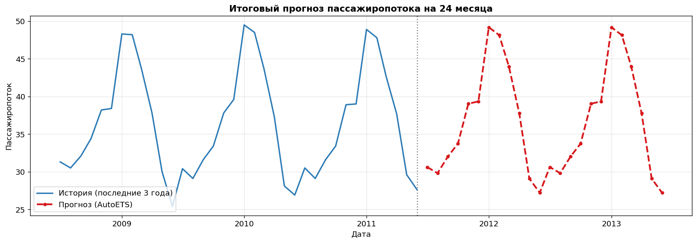


## 7. Выводы

### Задача 1 - EDA

Датасет содержит 150 месячных наблюдений (январь 1999 - июнь 2011). Ряд имеет устойчивую годовую сезонность: пики - январь-февраль (до 51.6%), минимумы - лето (от 23.5%). Прослеживается умеренный восходящий тренд. Данные высокого качества: пропусков и выбросов нет. ADF (p=0.076) и KPSS (p>0.1) дали противоречивые результаты. После первого дифференцирования (d=1) ряд стал стационарным (ADF p=0.032).

### Задача 2 - Статистические модели

Лучшая модель - AutoETS (MAE=0.689, RMSE=0.910, MAPE=2.03%, sMAPE=1.99%). Экспоненциальное сглаживание превзошло AutoARIMA (RMSE=1.820) и AutoTheta (RMSE=0.968) благодаря прямому моделированию тренда и сезонности. Ручные модели (ManualETS RMSE=1.407, ManualARIMA RMSE=1.630) уступают авто-версиям: автоподбор нашел более оптимальную структуру, чем фиксированные параметры по ACF/PACF. Анализ остатков подтвердил адекватность AutoETS: распределение близко к нормальному, автокорреляция отсутствует (Ljung-Box p > 0.05).

### Задача 3 - ML и DL

Лучшая ML-модель - XGBoost (MAE=1.030, RMSE=1.269, MAPE=3.00%). Ключевые признаки: lag_12 (~35%), lag_1 (~20%), rolling_mean_12 (~15%), что отражает доминирование годовой сезонности. Среди DL лучший результат - LSTM (MAE=1.119, RMSE=1.367, MAPE=3.11%): рекуррентная архитектура эффективнее улавливает временные зависимости на коротком ряду, чем NBEATS (RMSE=1.918) и NHITS (RMSE=2.439).

### Задача 4 - Пайплайн

Пайплайн выполнился за 3.86 сек. Включает 5 шагов: загрузка -> feature engineering (19 признаков) -> обучение -> прогноз (24 точки) -> сохранение. Пайплайн корректно обрабатывает пропуски (5%, 7 строк) и выбросы (5%, 7 строк), сохраняя полный прогноз на 24 месяца.


## Общее заключение

Набор данных: Train Occupancy Time Series (Kaggle), 150 месячных наблюдений, январь 1999 - июнь 2011.

Цель: прогнозирование месячной заполняемости железнодорожных вагонов на горизонт 24 месяца.

Лучшая модель: AutoETS (Statistical).

Итоговый результат: MAE=0.689, RMSE=0.910, MAPE=2.03%, sMAPE=1.99%.

Статистический подход (AutoETS) оказался наиболее точным на данном датасете. Полученный результат можно объяснить тем, что ряд имеет выраженную сезонность и тренд, которые ETS моделирует напрямую, тогда как ML- и DL-методы требуют большего объема данных для выявления аналогичных паттернов. ML-модели (XGBoost RMSE=1.269, Random Forest RMSE=1.305) показали конкурентоспособные результаты и могут быть предпочтительны при наличии дополнительных внешних признаков. DL-модели (LSTM RMSE=1.367) продемонстрировали приемлемое качество, однако на 150 наблюдениях их преимущество перед классическими методами не реализовалось.


## 8. Структура репозитория

```text
project/
├── data/
│   ├── raw/                    # Исходные CSV-файлы (скачать с Kaggle)
│   └── processed/              # Агрегированные данные и прогнозы
│
├── notebooks/
│   └── final_project.ipynb     # Основной notebook с полным анализом
│
├── src/
│   ├── data_preparation.py     # Загрузка, очистка, агрегация
│   ├── eda.py                  # Визуализации и тесты стационарности
│   ├── statistical_models.py   # Статистические модели
│   ├── ml_models.py            # ML-модели
│   ├── dl_models.py            # DL-модели
│   ├── backtesting.py          # Бектестинг и сравнение
│   └── pipeline.py             # Пайплайн
│
├── reports/
│   └── figures/                # Все графики (PNG)
│
├── requirements.txt
└── README.md
```
